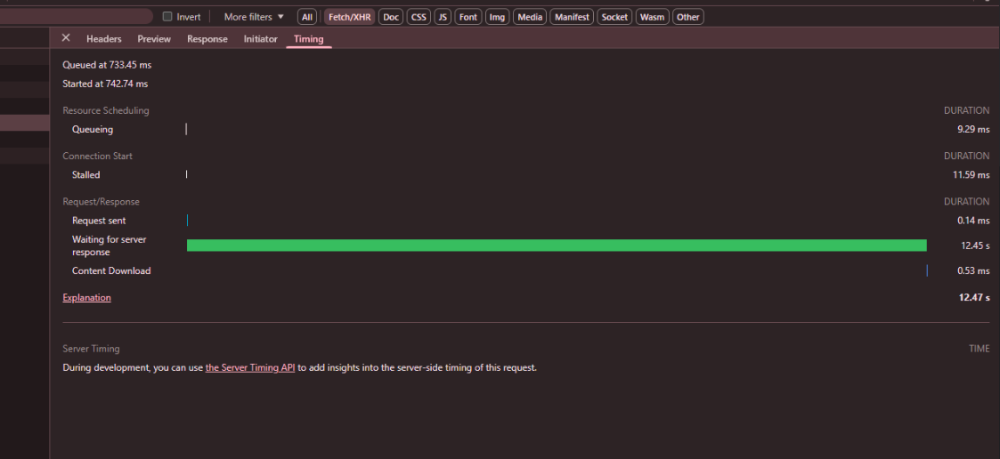
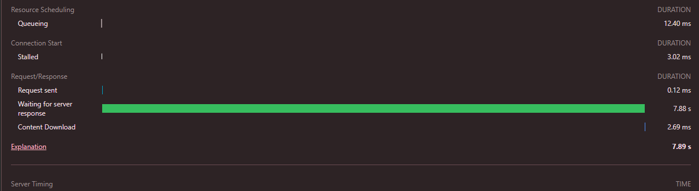
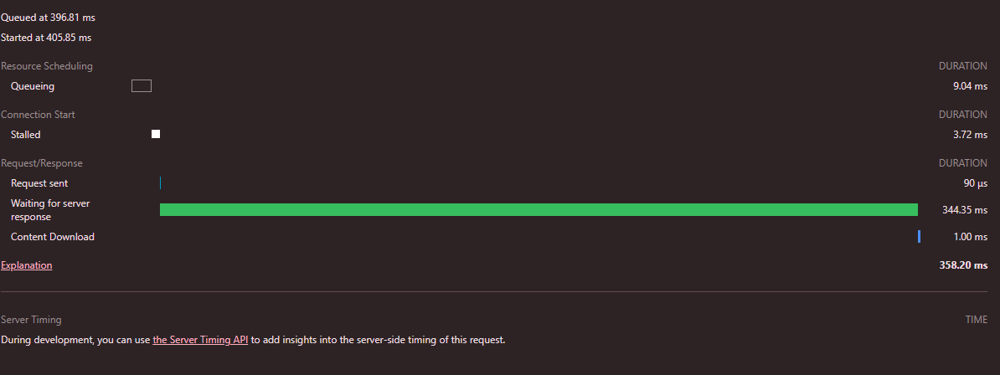
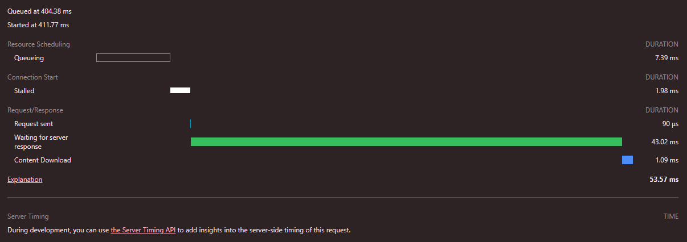

# Performance Optimization: Distance Matrix Caching & Routing Migration
::: info Cache Key Breakdown
* **`distanceMatrix`**: The namespace isolating this specific cache layer.
* **`branch:1`**: The unique identifier of the restaurant branch.
* **`loc:41.3200,19.7920`**: The user's coordinates rounded to 4 decimal places (precise to ~11 meters), ensuring high hit rates for nearby users.
* **`provider:STANDARD/HIGH_ACCURACY`**: The routing provider used (OpenRouteService->STANDARD or Google Maps->HIGH_ACCURACY), preventing data cross-contamination.
  :::
## 1. Baseline Performance: No Caching
*With all caching mechanisms disabled, every single restaurant requires a real-time distance calculation.*



---

## 2. Distance Matrix Cache Enabled: Initial Request
*The `distanceMatrixCaching` mechanism is active, but this represents the first request (cache miss). All other application caches remain disabled.*



---

## 3. Distance Matrix Cache Enabled: Second Request (Cache Hit)
*The page is reloaded with `distanceMatrixCaching` active. The application successfully reads the data from the cache.*



---

## 4. Distance Matrix Cache Enabled: Subsequent Request
*A consecutive page reload demonstrating consistent, low-latency performance utilizing the cached distance data.*



---

## Problem Statement

While caching ensures a smooth, low-latency experience for returning users, the initial dashboard load suffers from severe latency due to roughly 30 individual external API calls per user. Utilizing Google's bulk matrix API would resolve the speed issue, but it introduces prohibitive infrastructure costs—estimated at $3,000/month for every 100,000 visitors.

Migrating to an on-premise **OpenRouteService (ORS)** instance eliminates these external API fees entirely. However, simply swapping the provider is insufficient. Executing 30 individual HTTP requests to a local ORS server per page load introduces an **"N+1" query problem**, resulting in heavy CPU overhead and network connection bottlenecking.

---

## OpenRouteService Migration & Comparative Analysis

To resolve this, a routing provider strategy was implemented to compare individual sequential requests against a bulk-batched approach.

```java
List<BranchSummaryDto> deliverableBranchDTOs = branches.stream().map(
    branch -> new BranchWithDeliveryInfo(
        branch,
        pricingService.calculateDeliveryInfo(branch, userLatitude, userLongitude, RoutingProvider.STANDARD) // Introduced provider routing
    )
).toList();